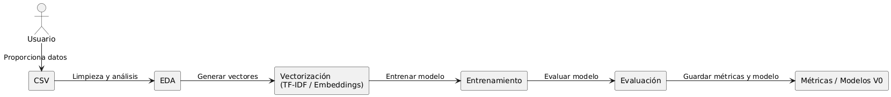

# Biomedical Classification Challenge

## Contexto

Este proyecto fue desarrollado para el **Data Challenge de Clasificación Biomédica con IA**.  
El objetivo es construir una solución de Inteligencia Artificial que clasifique artículos de investigación médica en uno o varios dominios:

- **Cardiovascular**
- **Neurological**
- **Hepatorenal**
- **Oncological**

La clasificación se realiza a partir de dos campos de texto por artículo:

- `title` → título del artículo
- `abstract` → resumen científico

---

## Objetivo

Dado un artículo médico (título + abstract), el sistema debe predecir correctamente su(s) categoría(s).  
Se trata de un **problema de clasificación multi-etiqueta**.

---

## Dataset

- Registros: **3,565 artículos**
- Columnas principales:
  - **title**: título del artículo
  - **abstract**: resumen científico
  - **group**: categoría(s) médica(s) a la que pertenece el artículo

El dataset fue provisto por la organización del challenge y combina datos de **NCBI**, **BC5CDR** y registros sintéticos.

---

## Tecnologías utilizadas

- **Python 3.10+**
- **Librerías de Ciencia de Datos**: pandas, numpy, scikit-learn
- **NLP (Procesamiento de Lenguaje Natural)**: NLTK, scikit-learn (TF-IDF), sentence-transformers (para embeddings)
- **Visualización**: matplotlib, seaborn, V0 (bonus)
- **Gestión del proyecto**: GitHub, notebooks (Jupyter)

---

## Estructura

```plaintext
biomedical-classification/
│
├── data/
│ └── dataset.csv
│
├── notebooks/
│ ├── 01_eda.ipynb            -> análisis exploratorio
│ ├── 02_train_baseline.ipynb -> modelo baseline (TF-IDF + Logistic Regression)
│ ├── 03_embeddings.ipynb     -> mejora con embeddings
│ └── 04_compare_models.ipynb -> compara las métricas entre baseline y embeddings
│
├── src/
│ ├── data_loader.py
│ ├── preprocessing.py
│ ├── train.py
│ ├── evaluate.py
│ └── utils.py
│
├── models/            # modelos entrenados (.joblib)
├── evidence/          # capturas, prompts y resultados de V0
│
├── requirements.txt   # librerías necesarias
└── README.md          # este archivo
```

---

## Solución propuesta

1. **EDA (Exploratory Data Analysis)** → entender distribución de clases, textos y multi-etiquetas.
2. **Baseline con TF-IDF + Logistic Regression**
   - Transformar `title + abstract` en vectores numéricos con TF-IDF.
   - Entrenar un clasificador multi-etiqueta usando One-vs-Rest Logistic Regression.
   - Evaluar con métricas: **F1 ponderado (weighted F1)**, precisión y matriz de confusión.
3. **Mejora con embeddings semánticos**
   - Usar `sentence-transformers` (ej. `all-MiniLM-L6-v2`) para obtener representaciones vectoriales.
   - Entrenar un modelo clásico (Logistic Regression o XGBoost) sobre estos embeddings.
4. **Visualización de resultados**
   - Graficar métricas y matriz de confusión en Python.
   - Crear visualizaciones interactivas en **V0** (bonus).
5. **Entrega final**
   - Guardar modelo entrenado en `/models/`.
   - Documentar resultados y visualizaciones en `/evidence/`.

---

## Diagrama del pipeline



---

## Entrenar y evaluar (Notebooks)

- `notebooks/02_train_baseline.ipynb` → Entrena y evalúa el modelo **baseline** (TF-IDF + Logistic Regression).
  
- `notebooks/03_embeddings.ipynb` → Entrena y evalúa la versión mejorada con **embeddings**.
  
- `notebooks/04_compare_models.ipynb` muestra comparativamente cómo se desempeñan los modelos:

  - Carga métricas de validación y test de **baseline** y **embeddings**.
  - Genera una **tabla comparativa** con Exact Match, F1 Micro y F1 Macro.
  - Crea un **gráfico de barras** para visualizar las diferencias entre modelos.
  - También permite ver métricas por clase desde `all_metrics.json` en un DataFrame.


Cada notebook muestra:  
- Métricas (**F1 ponderado, precisión, recall, exactitud**).  
- La **matriz de confusión**.  

**Salidas generadas:**  
- Modelos entrenados en `/models/`.  
- Evidencias de evaluación en `/evidence/`:
  
   - `baseline_val/`, `baseline_test/`, `embeddings_val/`, `embeddings_test/`.
   - Métricas agregadas en `all_metrics.json`
   - Informe final `REPORT.md` (resumen de métricas, capturas, reflexiones y limitaciones)

---

## Evaluar un CSV nuevo (inferencia)

La evaluación de un archivo CSV externo se realiza directamente en:  

- `notebooks/01_eda.ipynb`  

### Pasos:

1. Modificar la ruta de entrada al CSV en la celda correspondiente:  
   ```python
   # Cargar dataset desde ruta local
   rutaLocal = "./data/mi_nuevo_archivo.csv"

   # O cargar dataset directamente desde una URL
   # rutaURL = "https://techspherecolombia.com/wp-content/uploads/2025/08/challenge_data-18-ago.csv"

   df = cargar_dataset(rutaLocal)
    ```
2. El CSV debe tener las columnas:
   
    - **title**: título del artículo
    - **abstract**: resumen científico
    - **group**: categoría(s) médica(s) a la que pertenece el artículo

3. Ejecutar las celdas para cargar el dataset y aplicar el pipeline de inferencia.

## Cómo usar este repositorio (Windows)

1. Clonar el repositorio:
   ```bash
   git clone https://github.com/kevinramos2/Biomedical-Classification-Challenge.git
   cd biomedical-classification
   ```
2. Crear entorno virtual:
   ```bash
   python -m venv .venv
   ```
3. Activar entorno virtual (cada vez que abras el proyecto):
   ```bash
   .\.venv\Scripts\Activate.ps1
   ```
4. Instalar dependencias:
   ```bash
   pip install -r requirements.txt
   ```
5. Abrir los notebooks en orden:
   ```bash
   notebooks/01_eda.ipynb
   notebooks/02_train_baseline.ipynb
   notebooks/03_embeddings.ipynb (opcional)
   ```
6. Revisar modelos entrenados en /models/ y resultados en /evidence/.

## Cómo usar este repositorio (macOS o Linux)

Usa estos comandos:

```bash
python3 -m venv venv
source venv/bin/activate
pip install -r requirements.txt
python -m ipykernel install --user --name=venv --display-name "Python (venv)"
```

## Equipo

Este proyecto fue desarrollado por:

- **Juan Felipe Miranda Arciniegas** — Estudiante de Ingeniería de Sistemas, Universidad Nacional de Colombia
- **Luis Alejandro Martínez Ramírez** — Estudiante de Ingeniería de Sistemas, Universidad Nacional de Colombia
- **Kevin Leandro Ramos Luna** — Estudiante de Ingeniería de Sistemas, Universidad Nacional de Colombia
